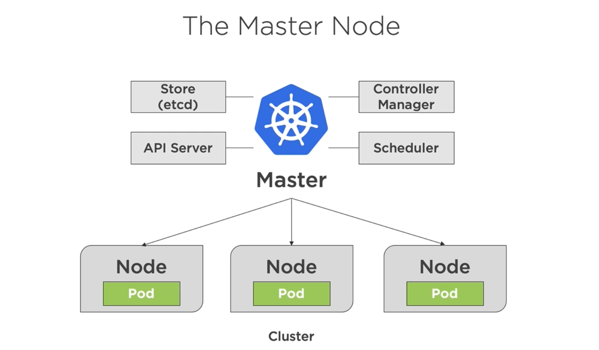
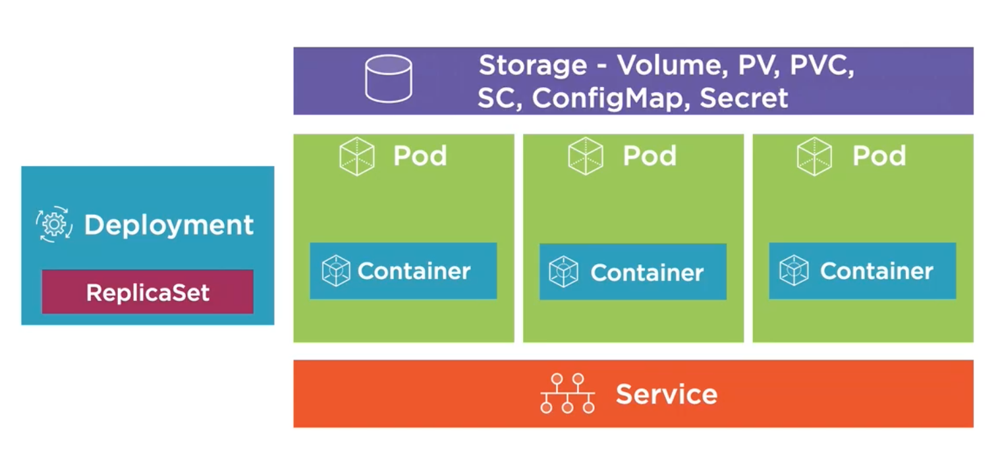
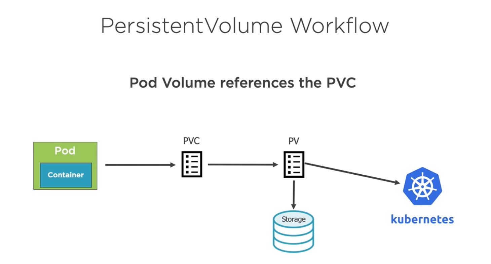

link:../README.md[Back]

= kubernetes =



== benefits ==

  - orchestrate containers
  - zero-downtime deployment
  - self healing
  - scale containers

== building blocks ==



  - deployment (provides declarative updates for Pods and ReplicaSets)
  - replicaSet (A ReplicaSet's purpose is to maintain a stable set of replica Pods running at any given time. As such, it is often used to guarantee the availability of a specified number of identical Pods)
  - pod
  - service (single point of entry to access one or more pods) IP address is reliable
  - storage

== services ==

  - ClusterIP - for inner claster communications (invisible outside the cluster without `port fowarding`)
  - NodePort - expose the service
  - LoadBalancer - expose the service ans act as a load balancer
  - ExternalName - maps service (proxy to external service) to DNS name

== storage ==

  - Ephemeral storage (emptyDir) has lifetime of the pod
  - Persistent storage (third party / cloud / ...)
  - PersistentVolumes, PersistentVolumeClaims and StorageClasses
  - ConfigMaps (key/value pairs)
  - Secrets



== k8s commands ==

```
kubectl scale deployment [deployment-name] --replicas=5
kubectl logs [pod-name]
kubectl logs [pod-name] -c [container-name]
kubectl logs -p [pod-name] # view logs for previously running pods
kubectl logs -f [pod-name] # stream pod's log
kubectl describe pod [pod-name]
kubectl get namespaces --show-labels
kubectl get all -n=[namespace-name]
kubectl get pod [pod-name] -o yaml
kubectl get ingress -n=[namespace-name]
kubectl get deployment [deployment-name] -o yaml
kubectl exec [pod-name] -it sh
kubectl create namespace [namespace-name]
kubectl create secret tls [secret-name] -n=[namespace-name] --key=[path-to-privkey] --cert=[path-to-cert]
kubectl create -n=[namespace-name] -f [folder] --save-config --record
kubectl apply -n=[namespace-name] -f [folder]
kubectl delete -f [folder]
kubectl delete namespaces [namespace-name]
kubectl port-forward [pod-name] [port-from:port-to]
```

== minikube ==

```
minikube start
minikube addons enable ingress
```

== helm commands ==

```
helm lint [folder]
helm install [release-name] [folder]
helm uninstall [release-name]
helm upgrade [release-name]
helm ls --all
helm get all [release-name]
helm get manifest [release-name]
helm install --generate-name --dry-run --debug stockreaper/charts/frontend
```

== k8s web ui (dashboard) ==

https://kubernetes.io/docs/tasks/access-application-cluster/web-ui-dashboard/

  - `kubectl apply [dashboard-yaml-url]`
  - `kubectl describe secret -n kube-system`
  - locate the kubernetes.io/service-account-tocken and copy the token
  - `kubectl proxy`
  - visit the dashboard url and login using the token
